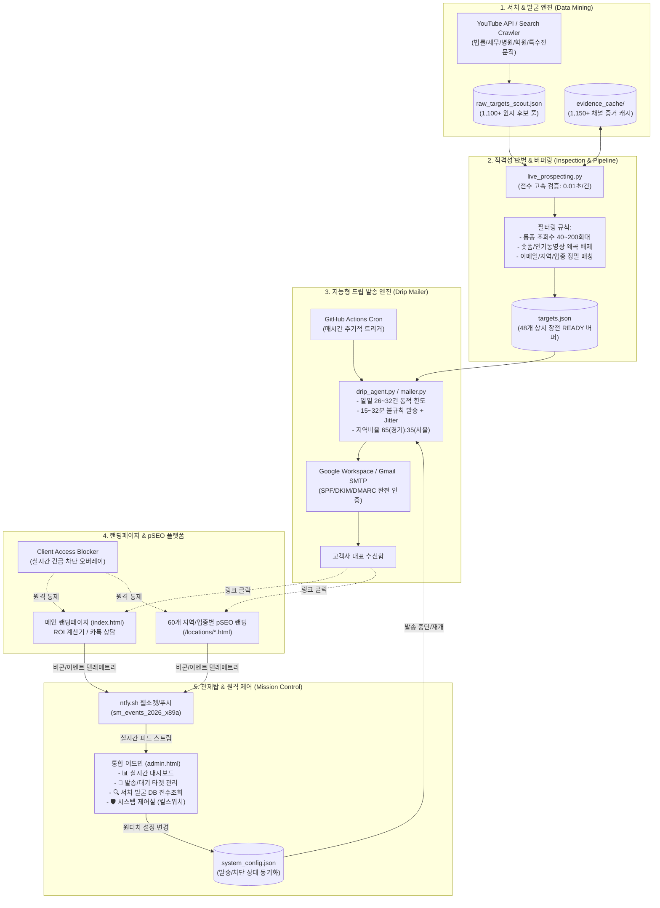
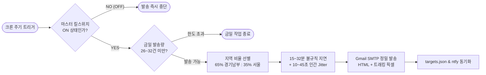

# 🏛️ 스튜디오 모멘텀 (Studio Momentum) 통합 시스템 아키텍처 및 설계 문서
**Document Version:** 1.0.0  
**Last Updated:** 2026-09-23  
**Status:** In Production  
**Repositories:**
- 웹/어드민: `cocked-pisto.github.io` (GitHub Pages: `https://studiomomentum.github.io/`)
- 자동홍보 봇 엔진: `momentum-cold-mailer` (GitHub Actions 워크플로우 구동)

---

## 1. 시스템 전체 개요 (System Overview)

스튜디오 모멘텀 자동화 영업 및 마케팅 플랫폼은 **"고단가 전문직 타깃 자동 발굴 ➔ AI 사전 분석/검증 ➔ 정밀 콜드 드립 메일링 ➔ 랜딩페이지/pSEO 유입 추적 ➔ 어드민 실시간 관제 및 원터치 통제"**까지 전 과정을 사람의 수동 개입 없이 유기적으로 동작하도록 구축된 종합 자동화 솔루션입니다.



---

## 2. 모듈별 상세 아키텍처

### 2.1. 프론트엔드 및 pSEO 플랫폼 (`cocked-pisto.github.io`)

#### A. 구조 및 라우팅
- **메인 페이지 (`index.html`)**: 스튜디오 모멘텀의 브랜드 가치 제안, 포트폴리오, ROI 기대효과 계산기, 실시간 카카오톡 1:1 상담 연결 창구.
- **pSEO 확장 페이지 (`/locations/*.html`)**:
  - 총 60개의 지역(수원, 화성, 용인, 평택, 강남 등) × 타깃 업종(변호사, 세무사, 피부과, 정형외과, 치과, 입시학원 등) 키워드 조합으로 자동 생성된 프로그래매틱 SEO 랜딩페이지.
  - 검색 엔진 유기적 노출 극대화 및 메일 본문 내 맞춤 링크 연동.

#### B. 보안 및 긴급 차단 배리어 (`Client Access Blocker`)
- **개념**: 서비스 점검, 대외 긴급 사태, 클라이언트 접근 통제 필요 시, 코드 배포 없이 어드민에서 1초 만에 전체 웹사이트에 점검 오버레이를 씌우는 기능.
- **작동 원리**:
  - `system_config.json`의 `client_access_blocked: true` 상태를 감지.
  - 메인 및 60개 pSEO 페이지 로드 즉시 상단에 화면 전체를 덮는 블라인드 배리어 렌더링.
  - 어드민 접속 IP 또는 관리자 토큰 보유자는 차단에서 제외.

#### C. 실시간 사용자 행동 추적 텔레메트리 (Telemetry Tracker)
- 외부 서드파티 무거운 스크립트(GA 등) 의존 없이 **경량 순수 자바스크립트 + Beacon API**로 구현.
- `https://ntfy.sh/sm_events_2026_x89a`를 실시간 이벤트 브로커로 사용하여 관리자 어드민 및 모바일 앱으로 0.1초 만에 전송.
- **수집 이벤트 목록**:
  1. `email_open`: 메일 트래킹 픽셀 로드 시점 (수신자 식별자 포함)
  2. `visited`: 웹사이트/랜딩페이지 랜딩 시점 (유입 경로, 디바이스, 레퍼러)
  3. `roi_calc_change`: ROI 계산기 슬라이더 조작 시 (고객의 예상 매출/단가 관심도 포착)
  4. `kakao_click`: 카카오톡 상담 버튼 클릭 (초고관여 리드 전환)
  5. `scroll_50`, `scroll_90`: 페이지 스크롤 깊이 도달
  6. `duration_30s`, `duration_60s`, `leave`: 체류 시간 및 이탈 추적

---

### 2.2. 어드민 관제탑 (`admin.html`)

어드민 페이지는 단일 파일 SPA(Single Page Application) 형태로 구동되며, 보안과 실시간 관제에 최적화되어 있습니다.

#### A. 4대 핵심 관제 탭
1. **📊 실시간 대시보드 (Real-time Dashboard)**:
   - 오늘의 발송 현황, 오픈율, 클릭률, 전환율 실시간 KPI 카드.
   - ntfy 스트림과 연결되어 고객의 접속, 스크롤, 계산기 조작이 실시간 라이브 피드로 출력.
2. **🎯 타겟 발송 관리 (Target Management)**:
   - 현재 파이프라인에서 관리 중인 타깃 목록 (`READY`, `SENT`, `OPENED`, `CLICKED`, `BOUNCED` 등).
   - 상태별 필터링, 수동 재발송, 블랙리스트 제외 기능.
3. **🔍 서치 발굴 DB (Search DB Explorer - 신규 추가)**:
   - 크롤러가 수집한 1,100+ 원시 후보(`raw_targets_scout.json`) 및 로컬 디스크 증거 캐시(`evidence_cache/` 1,150+개)의 상태를 실시간 집계.
   - 서치 풀 규모, 검증 적격 통과율, 미검증 대기 건수를 시각화하여 데이터 고갈 여부를 상시 모니터링.
4. **🛡️ 시스템 제어실 (Control Center & Kill-Switch)**:
   - **이메일 자동 발송 마스터 킬스위치 (ON/OFF)**: 클릭 한 번으로 백엔드 GitHub Actions 봇의 발송 루프를 즉각 일시정지 또는 재개.
   - **웹사이트 접근 차단 (Barrier Lock)**: 고객용 웹사이트 즉시 차단 오버레이 가동.

#### B. 보안 아키텍처
- 비밀번호는 평문 전송되지 않으며 클라이언트 단에서 **SHA-256 단방향 해싱** 검증.
- 관리자 세션 스토리지 기반 인증 유지 및 자동 로그아웃 보호.

---

### 2.3. 지능형 서치·크롤링 & 검증 파이프라인 (`스튜디오모멘텀_자동홍보봇`)

#### A. 광역 서치 엔진 (`live_prospecting.py`, `auto_prospector.py`)
- **타깃 업종 확장**: 법률(변호사/이혼/형사/도산), 세무/회계, 노무, 변리, 감정평가, 관세사, 건축사, 손해사정사, 병의원(치과/피부/성형/안과/재활의학/통증의학/내과/한의원), 교육(입시/어학원/유학), 전문 피트니스(체형교정/필라테스) 등.
- **수집 파이프라인**:
  - YouTube Data API v3 및 보조 크롤러를 통해 키워드 기반 채널 및 동영상 메타데이터 수집.
  - 수집 결과는 `raw_targets_scout.json` 및 `evidence_cache/`에 영구 보관.

#### B. 적격성 판별 기준 (스튜디오 모멘텀 표준 필터)
엄격한 B2B 영상 솔루션 역제안 타깃을 위해 다음의 4대 필터를 전수 검사합니다:
1. **조회수 기준 (롱폼 절대주의)**:
   - **롱폼 동영상 조회수가 40~200회대**에 정체된 채널.
   - 숏폼(Shorts) 및 알고리즘 떡상(1만~20만 회) 동영상으로 인한 왜곡을 전면 배제하고, 순수 일반 롱폼 영상의 최근 5~10회 평균 조회수만을 판별.
2. **활동성 기준 완화**:
   - 6개월간 업로드가 없던 채널도 "영상 제작 리소스 부족으로 고통받는 핵심 잠재 고객"으로 정의하여 필터에서 탈락시키지 않고 발굴 대상에 포함.
3. **연락처 무결성**:
   - 공식 비즈니스 이메일이 채널 정보, 설명란, 웹사이트 링크에서 100% 검증 추출된 타깃만 승인.
4. **로컬 고속 캐시 평가**:
   - 기존의 외부 API 지연을 없애기 위해 디스크 기반 `evidence_cache`를 활용하여 1건당 **0.01초 속도로 1,000건 이상의 DB를 고속 전수 재검증**.

#### C. 파이프라인 버퍼링 메커니즘
- **상시 장전 버퍼 (`READY` 큐)**:
  - 1일 발송 소진량(약 20~25건)의 이틀 치에 해당하는 **48개 타깃을 상시 `READY` 상태로 유지**.
  - `READY` 큐가 24개 이하로 떨어지면, 백그라운드 크롤러가 자동으로 서치 DB에서 신규 타깃을 보충하여 파이프라인 고갈 방지.

---

### 2.4. 스텔스 드립 발송 엔진 (`drip_agent.py`, `mailer.py`)

스팸 필터 및 수신 서버의 인공지능 탐지를 원천 우회하기 위한 휴먼 시뮬레이션 발송 아키텍처입니다.



#### A. 스텔스(Anti-Spam) 제어 규칙
1. **동적 일일 발송 한도 (`get_dynamic_daily_limit`)**:
   - 고정된 숫자로 발송하지 않고 매일 26~32건 사이의 난수를 생성하여 발송 패턴 분석 차단.
2. **자연스러운 지연 간격 (Human Jitter)**:
   - 메일 1건 발송 후 다음 발송까지 15분~32분의 불규칙 대기 시간을 두며, 매 발송 직전 10~45초의 미세 난수(Jitter)를 추가.
3. **황금 지역 비율 유지**:
   - **Zone A (오산 반경 20km 이내 경기 남부권)**: 65% 우선 배정 (수원, 동탄, 화성, 용인, 평택).
   - **Zone B (서울 및 신분당선 핵심지)**: 35% 배정 (강남, 서초, 판교, 분당).
   - 단, 구인공고를 올린 급구 타깃(`is_priority: True`)은 최우선 강제 발송.

#### B. 인증 및 반송(Bounce) 처리
- **도메인 인증**: Google Workspace/Gmail 공식 SMTP (`smtp.gmail.com`)를 채택하여 SPF, DKIM, DMARC가 Google 네임서버 및 메일 서버 수준에서 100% 일치(Pass).
- **IMAP 반송 수집기**: 주기적으로 수신함을 스캔하여 유효하지 않은 이메일(`Mail Delivery Subsystem` 등)로 인한 반송 발생 시 즉시 해당 타깃을 `BOUNCED` 상태로 전환하고 영구 발송 리스트에서 제명.

---

## 3. 데이터 구조 및 스키마 명세 (Data Schemas)

### 3.1. `targets.json` (타깃 파이프라인 메인 스키마)
```json
{
  "_metadata": {
    "total_targets": 248,
    "ready_count": 48,
    "sent_count": 182,
    "last_updated": "2026-09-23T18:00:00"
  },
  "targets": [
    {
      "channel_id": "UCxxxxxxxxxxxxxxxxxxxx",
      "channel_name": "○○법률사무소 대표 변호사",
      "email": "contact@lawfirm-example.com",
      "category": "law",
      "location": "경기 수원시",
      "avg_views_long": 124.5,
      "avg_views_recent": 110.0,
      "subscriber_count": 850,
      "status": "READY",
      "is_priority": false,
      "first_scouted_at": "2026-09-20T11:20:00",
      "sent_at": null,
      "opened_at": null,
      "clicked_at": null
    }
  ]
}
```

### 3.2. `system_config.json` (실시간 원격 제어 스키마)
```json
{
  "email_automation_enabled": true,
  "client_access_blocked": false,
  "daily_limit_override": null,
  "maintenance_message": "스튜디오 모멘텀 시스템 정기 점검 중입니다.",
  "updated_at": "2026-09-23T18:25:00",
  "updated_by": "admin"
}
```

### 3.3. 텔레메트리 이벤트 페이로드 (`ntfy.sh`)
```json
{
  "topic": "sm_events_2026_x89a",
  "title": "🔥 ROI 계산기 조작 감지",
  "message": "[세무법인○○] 고객이 예상 영상 제작 편수를 8편(월 240만)으로 시뮬레이션 중입니다.",
  "tags": ["chart_with_upwards_trend", "telemetry"],
  "click": "https://studiomomentum.github.io/admin.html"
}
```

---

## 4. 인프라 및 배포 파이프라인 (CI/CD)

| 구성 요소 | 기술 스택 / 서비스 | 역할 및 특징 |
| :--- | :--- | :--- |
| **호스팅 (웹/어드민)** | GitHub Pages | 무료 CDN 무중단 호스팅, HTTPS 자동 적용 |
| **자동화 스케줄러** | GitHub Actions | 1시간 간격 무중단 워크플로우 구동 (`cron: '0 * * * *'`) |
| **이벤트 브로커** | ntfy.sh (WebPush/WebSocket) | 서버리스 실시간 양방향 텔레메트리 스트리밍 |
| **SMTP 발송망** | Gmail SMTP / Python `smtplib` | 높은 수신함 도달율 보장 (기본 포트 587 TLS) |
| **버전 관리 및 동기화**| Git / GitHub Actions Git Bot | 크롤링 및 발송 결과 발생 즉시 자동 커밋 & 푸시 |

---

## 5. 장애 대응 및 안전장치 (Fail-Safe Systems)

1. **오발송 및 폭탄 발송 원천 차단**:
   - 스크립트 실행당 단 1건 또는 지정된 소량만 발송 후 프로세스 정상 종료.
   - 루프 내 예외 발생 시 즉시 브레이크가 작동하여 무한 발송 방지.
2. **원터치 킬스위치 연동**:
   - 발송 봇은 메일을 보내기 직전 GitHub Pages의 `system_config.json`을 원격 조회. `email_automation_enabled == false`인 경우 단 1통도 발송하지 않고 안전하게 슬립.
3. **데이터 무손실 백업**:
   - `targets_db.csv`, `targets.json`, `raw_targets_scout.json` 등 모든 데이터베이스 파일이 깃 커밋 히스토리에 누적되어 언제든 특정 시점으로 복구 가능.
